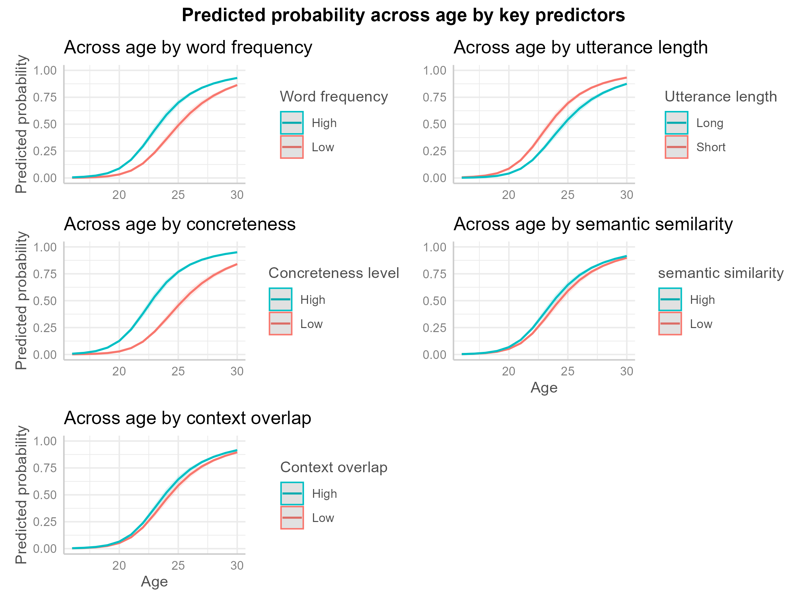

# CODE FOR WORD COUNT
# save the file before running this chunk
```{r}

# CODE FOR WORD COUNT
# save the file before running this chunk


text <- readLines("Dissertation.qmd", warn = FALSE)

# Remove YAML header
if (text[1] == "---") {
  end_yaml <- which(text == "---")[2]
  text <- text[-(1:end_yaml)]
}

# Remove code chunks
inside_chunk <- FALSE
clean_text <- character()

for (line in text) {
  if (grepl("^```", line)) {
    inside_chunk <- !inside_chunk
    next
  }

  if (!inside_chunk) {
    clean_text <- c(clean_text, line)
  }
}

# Count words
words <- unlist(strsplit(paste(clean_text, collapse = " "), "\\s+"))
words <- words[words != ""]

cat("Word count:", length(words), "\n")
```


```{r}

# Load packages 

library(knitr)
library(dplyr)
library(tidyr)
library(knitr)
```

# Abstract

# Leveraging Word Knowledge from Everyday Language

# Language Characteristics that Contribute to Word Learning

# Learning Words from the Company they Keep?

# Present Study


# Methods


### DESCRIPTIVE STATS TABLE 
```{r}
#| echo: false

# DESCRIPTIVE STATS TABLE for Age of Acquisition dataset
mcdi_descriptives <- readRDS(
  "Data/mcdi_descriptive_stats.rds"
)

mcdi_descriptives %>%
  pivot_longer(
    everything(),
    names_to = "Statistic",
    values_to = "Value"
  ) %>%
  mutate(
    Statistic = recode(
      Statistic,
      observations = "Observations",
      children = "Children",
      words = "Words",
      min_age = "Minimum age (months)",
      max_age = "Maximum age (months)",
      mean_age = "Mean age (months)",
      median_age = "Median age (months)",
      sd_age = "Age SD",
      known_words_pct = "Known words (%)"
    ),
    Value = case_when(
      Statistic == "Observations" ~ format(
        round(as.numeric(Value), 0),
        big.mark = ",",
        scientific = FALSE
      ),
      Statistic %in% c(
        "Children",
        "Words",
        "Minimum age (months)",
        "Maximum age (months)"
      ) ~ as.character(round(as.numeric(Value), 0)),
      Statistic %in% c(
        "Mean age (months)",
        "Median age (months)",
        "Age SD"
      ) ~ sprintf("%.1f", as.numeric(Value)),
      Statistic == "Known words (%)" ~ paste0(
        sprintf("%.1f", as.numeric(Value)),
        "%"
      )
    )
  ) %>%
  kable(
    col.names = c("Statistic", "Value"),
    caption = "Descriptive statistics for the longitudinal MCDI dataset."
  )
```


## Datasets / Variables

The present study combined longitudinal vocabulary data, lexical predictor measures, and caregiver speech corpora to investigate factors associated with children's word acquisition. Six datasets were used to construct the final analytic dataset.

### mcdi_aoa
The primary dataset was mcdi_aoa, a longitudinal vocabulary dataset derived from the MacArthur-Bates Communicative Development Inventories (MBCDI). Each row represented a child–age–word observation, indicating whether a particular child was reported to produce a given word at a specific age. The dataset included child identity (child_id), age in months (age), and a binary outcome variable (value), where 1 indicated that the child acquired the word and 0 indicated that the child did not. Rather than looking only at when words were learned on average, this study kept data for each individual child, making it possible to track vocabulary growth over time between 16 and 30 months of age.

### abcon
The abcon dataset provided word-level concreteness ratings. Concreteness reflects the extent to which a word refers to perceptible objects, actions, or experiences. Higher scores indicate more concrete words, whereas lower scores indicate more abstract words. These ratings were used as a control predictor in the statistical analyses.

### utt_stats
The utt_stats dataset contained word-level measures calculated from caregiver speech transcripts. These measures describe the linguistic contexts in which words typically occur during child-directed speech. Two measures were used in the present study: mean utterance length (utt_length), representing the average length of utterances in which a word occurred, and utterance-final frequency (log_freq_final), representing how often a word occurred in utterance-final position. These measures were included as control predictors because utterance characteristics may influence word learning.

### childes_text
The childes_text dataset consisted of transcripts of caregiver speech obtained from the CHILDES corpus. Each row represented a transcript associated with a particular child age. This corpus served as the input language environment from which measures of word frequency, co-occurrence, contextual similarity, and context leverage were derived.

### childes_freq
The childes_freq dataset contained word frequency information calculated from the CHILDES corpus. For each word, the dataset provided raw frequency counts and log-transformed frequency values (log_freq). Word frequency was included as a control predictor because frequent words are typically acquired earlier than infrequent words.

### categories_raw
The categories_raw dataset contained semantic category labels for words. Each word was assigned to a broad semantic category and, where relevant, a more specific subcategory. These category labels were used to determine whether pairs of words belonged to the same or different semantic categories. This information was required for the calculation of semantic similarity (prop_same) and context leverage (within_overlap).


## Data Preparation

Prior to analysis, the CHILDES caregiver speech corpus was preprocessed to create a standardised representation of the language environment available to children. These preprocessing steps were designed to improve consistency across transcripts and ensure reliable calculation of frequency and contextual measures.

First, proper names were identified using the CHILDES Names dataset and replaced with a generic token (pname). This prevented individual names from inflating frequency counts or distorting patterns of word co-occurrence, while also protecting the privacy of children and caregivers.

Second, contractions were expanded to their full forms (e.g., I'll → I will). Words were then lemmatised so that morphological variants were represented by a single base form (e.g., dogs and dog; walking and walk). This meant that different versions of the same word were treated as one word, making it easier to calculate word frequencies and patterns of words appearing together.

Finally, word frequencies were calculated from the cleaned corpus. Low-frequency words were grouped into a single unknown-word category (UNK) using a frequency cutoff procedure. This reduced the number of rare words in the dataset in the co-occurrence data and increased the reliability of subsequent contextual similarity measures.
The resulting preprocessed corpus served as the basis for the calculation of word frequency, co-occurrence statistics, semantic similarity, and context leverage measures.


## Construction of Context Leverage

Context leverage was designed to capture the extent to which a target word occurs in contexts that are similar to those of earlier-learned words with related meanings. The underlying assumption is that word learning may be facilitated when a new word appears in contexts that resemble those of words that are already known. The measure was calculated in several stages involving semantic category matching, co-occurrence analysis, contextual similarity, and age-of-acquisition information.

### Semantic Category Matching and Word-Pair Generation
Semantic category information was obtained from the categories_raw dataset. All possible word pairs were generated and classified according to whether the two words belonged to the same semantic category or different semantic categories. To make sure contextual similarity could be measured from the perspective of each word, both orders of every pair were included (e.g., in dog–cat the word focus is dog, and in cat–dog the word focus is cat). In cases where a pair could be be classified as both same-category and different-category because a word belonged to multiple categories (e.g., orange–apple the category is the same when the meaning of orange is orange fruit, and different category when the meaning is the orange colour), the pair was classified as same-category whenever the two words shared at least one semantic category. This decision ensured that semantically related words were not excluded simply because one of the words also belonged to another category, allowing any meaningful semantic relationship between the pair to be retained in the analysis.

### Context Windows and Co-occurrence Counts
The CHILDES corpus was divided into overlapping windows of 11 words, meaning that each window contained a sequence of 11 consecutive words from the corpus. Words were considered to co-occur when they appeared within the same window. Co-occurrence frequencies were then calculated for all word pairs. For example, words such as dog and bark frequently appeared within the same local contexts and therefore received high co-occurrence counts, whereas unrelated words such as dog and spoon tended to receive lower counts.

### Positive Pointwise Mutual Information (PPMI)
Raw co-occurrence counts are strongly influenced by overall word frequency, meaning that highly frequent words may appear to co-occur with many other words simply by chance. To address this issue, Positive Pointwise Mutual Information (PPMI) was calculated for each pair of words. PPMI measures how strongly two words are associated by comparing how often they occur together with how often they would be expected to occur together by chance. As a result, meaningful associations such as dog–bark receive high PPMI values, whereas associations driven primarily by word frequency receive lower values (e.g., the–dog). This procedure reduces the influence of extremely common words and highlights informative contextual relationships.

### Context Overlap
For each word, the 100 words with the highest PPMI values were selected as its contextual neighbours. These are the words most strongly associated with the target word in the corpus after accounting for overall word frequency confounding. For example, a word such as dog might have contextual neighbours including bark, puppy, and leash, whereas a word such as spoon might be associated with words such as bowl, eat, and fork. The set of 100 highest-ranking neighbours was treated as the word's context. Context overlap between two words was then calculated using the Jaccard Index, which measures how many context words the two words share compared with the total number of context words they have altogether. For example, if two words have many of the same contextual neighbours, their Jaccard Index will be higher. If they share very few neighbours, their Jaccard Index will be lower. Higher Jaccard values indicate greater similarity between the contexts in which two words occur.

### Context Leverage
To calculate context leverage, context overlap scores were combined with semantic category information and age-of-acquisition estimates. For each target word, only words acquired earlier in development were considered. The mean context overlap between the target word and earlier-learned words from the same semantic category was calculated, as was the mean context overlap between the target word and earlier-learned words from different semantic categories.

Context leverage (within_overlap) was then calculated as the difference between these two averages. Positive values indicate that a target word occurs in contexts that are more similar to those of earlier-learned semantically related words than to those of earlier-learned semantically unrelated words. Larger values therefore reflect greater context leverage support for word learning.


## Construction of Meaning Leverage

Meaning leverage was designed to capture the extent to which a target word was surrounded by earlier-learned words from the same semantic category. For example, if the target word was *banana*, earlier-learned words such as *apple*, *orange*, and *grape* would contribute to its meaning leverage because they belong to the same semantic category (fruit). This measure was included as a control variable to account for the possibility that some words may be easier to learn simply because they have more semantically related neighbours that are already known.

For each target word, all words acquired earlier in development were first identified using age-of-acquisition estimates. The number of earlier-learned words belonging to the same semantic category as the target word was then counted and divided by the total number of earlier-learned words, producing the proportion of previously acquired words from the same category. For example, if a target word belonged to the animal category and a child had already acquired 100 words, of which 15 were animals, the resulting proportion would be 15/100 = 0.15.

Meaning leverage (`prop_same`) was calculated as the proportion of a word’s earlier-learned semantic neighbours that belonged to the same semantic category as the target word.

The resulting proportion was log-transformed to reduce skewness and limit the influence of extreme values. A small constant (0.0001) was added before the transformation because the logarithm of zero is undefined, ensuring that words with no earlier-learned neighbours from the same semantic category could still be assigned a valid value and retained in the analysis.

Higher values of `prop_same` indicate that a larger proportion of previously acquired words belong to the same semantic category as the target word. Including this measure allowed the analyses to distinguish the effect of context leverage from the simpler possibility that words are learned earlier because they have more semantically related neighbours available in the developing vocabulary.


## Final Dataset

Following the construction of the predictor variables, all measures were merged with the longitudinal vocabulary dataset (`mcdi_aoa`) using the standardised word forms as matching keys. This procedure produced a single dataset containing child-level vocabulary observations together with lexical and contextual predictors for each word.

The final dataset included the binary word acquisition outcome (`value`), age in months (`age`), child identity (`child_id`), and word identity (`word`). It also contained the main predictor of interest, context leverage (`within_overlap`), which quantified the extent to which a target word occurred in contexts similar to those of earlier-learned semantically related words.

Several control variables were included to account for alternative factors known to influence word learning. These were word frequency (`log_freq`), utterance length (`utt_length`), concreteness (`abcon`), and meaning leverage (`prop_same`). Including these variables allowed the contribution of context leverage to be evaluated while controlling for established predictors of vocabulary acquisition.


## Word Learning Outcome: Age of Acquisition


## Corpus of Children’s Everyday Language


## Context Leverage Metrics


## Calculating Context Similarity: Context Overlap


## CalculatingContextLeverage


## Control Variables


##########   retrieve models from folder 

```{r}
#| warning: false
#| message: false
#| fig-width: 10
#| fig-height: 8

p_log_freq <- readRDS("models/mixed_log_reg.rds")

```


# Results

## Standardise numeric predictors (z-scores)

### Why
Prior to statistical modelling, continuous predictor variables (log_freq, log_freq_final, utt_length, abcon, prop_same, and within_overlap) were standardised using z-score transformation. Standardisation placed predictors on a common scale, facilitating comparison of coefficient estimates across variables and improving model estimation.


### TABLE FINAL DATA SET 
```{r}

### View final data set
context_leverage_scale <- readRDS(
  "final dataset/context_leverage_scale.rds"
)
context_leverage_scale
```


### How
Following standardisation, only variables required for subsequent analyses were retained. Observations containing missing values were then removed so that all statistical models were fitted to a consistent dataset.


## JUSTIFY MIXED EFFECTS MODELS

### Why
The dataset contained repeated observations for both children and words, violating the assumption of independence required by standard logistic regression. Mixed-effects models were therefore evaluated to determine whether accounting for child- and word-level variability improved model fit.


### How
To evaluate whether this, two logistic regression models were compared. The first was a standard logistic regression model including age as a fixed predictor of vocabulary acquisition probability. The second was a mixed-effects logistic regression model that additionally included random intercepts for both word and child identity, allowing baseline vocabulary acquisition probability to vary across children and lexical items.
Model fit was compared using Akaike’s Information Criterion (AIC), with lower AIC values indicating better fit.


### TABLE
```{r}
#| message: false
#| warning: false

# Table comparison: Standard logistic regression / Mixed-effects logistic regression

aic_table <- data.frame(
  Model = c("Standard logistic regression",
            "Mixed-effects logistic regression"),
  df = c(2, 4),
  AIC = c(174471.04, 99536.73)
)

kable(
  aic_table,
  caption = "Comparison of model fit between standard logistic and mixed-effects logistic regression models."
)
```


### Results
The mixed-effects model provided a substantially better fit than the standard logistic regression model (Table X). Consequently, random intercepts for word and child identity were retained in all subsequent analyses.


## JUSTIFY AGE AS NON LINEAR PREDICTOR

### Why
Vocabulary acquisition is unlikely to progress at a constant rate across age. Periods of rapid vocabulary growth may be followed by slower developmental change, meaning that the relationship between age and acquisition probability may not be linear. Therefore, it was necessary to determine whether age should be modelled as a linear or non-linear predictor. A non-linear representation allows developmental changes in acquisition probability to be captured more flexibly and may provide a better fit to the data.


### How
To evaluate this, two mixed-effects logistic regression models were compared. Both models retained random intercepts for word and child identity, but the first model used age as a linear predictor whether the other model used age as a non-linear predictor, allowing the relationship between age and word acquisition probability to vary non-linearly.
The two models were compared AIC values. 


### TABLE 
```{r}
#| result: true

# Table comparison: Linear age / Non-linear age

age_model_comparison <- data.frame(
  Model = c("Linear age", "Non-linear age"),
  Parameters = c(4, 6),
  AIC = c(99537, 98236),
  LogLik = c(-49764, -49112),
  ChiSq = c(NA, 1304.9),
  Df = c(NA, 2),
  p = c(NA, "< .001")
)

kable(
  age_model_comparison,
  caption = "Comparison of linear and non-linear age models."
)
```


### Results
The non-linear age model provided a significantly better fit than the linear age model, as indicated by its lower AIC value and the significant likelihood ratio test (Table X). These results suggest that vocabulary acquisition follows a non-linear developmental trajectory rather than progressing at a constant rate across age. Consequently, the non-linear age model was retained for all subsequent analyses.


## JUSTIFY WHICH VARIABLES INCLUDE (MAIN EFFECT)


### Why
The next step was to determine which predictor variables should be retained as main effects in the model. The predictors considered were word frequency (log_freq), utterance length (utt_length), concreteness (abcon), proportion of same-category words (prop_same), and context leverage (within_overlap). Although all predictors were theoretically motivated, some may provide little additional explanatory information once the effects of the other predictors are taken into account. This analysis identified the predictors that contributed uniquely to explaining variation in word acquisition probability while avoiding unnecessary model complexity.

### How
A baseline mixed-effects logistic regression model was first fitted including all predictor variables alongside the non-linear representation of age. Random intercepts for word and child identity were retained.
A series of reduced models was then created by removing one predictor at a time from the baseline model. Each reduced model was compared against the baseline model using AIC values. Predictors were retained if their removal worsened model fit.


### TABLE 
```{r}
#| result: false

# Table comparison: all vars comparison

main_effect_table <- data.frame(
  Removed_predictor = c(
    "log_freq",
    "utt_length",
    "abcon",
    "prop_same",
    "within_overlap"
  ),
  Reduced_model_AIC = c(
    75495,
    75486,
    75508,
    75411,
    75414
  ),
  Full_model_AIC = c(
    75402,
    75402,
    75402,
    75402,
    75402
  ),
  ChiSq = c(
    94.96,
    85.98,
    108.15,
    11.03,
    14.74
  ),
  Df = c(1, 1, 1, 1, 1),
  p = c(
    "< .001",
    "< .001",
    "< .001",
    "< .001",
    "< .001"
  )
)

kable(
  main_effect_table,
  caption = "Model comparisons testing the contribution of each main-effect predictor."
)
```


### Results
Comparison of the reduced models against the baseline model showed that removing any predictor worsened model fit, as indicated by its lower AIC value and the significant likelihood ratio test (Table X). These results indicate that word frequency, utterance length, concreteness, proportion of same-category words, and context leverage each contributed unique explanatory information about word acquisition probability. Consequently, all predictors were retained as main effects for the subsequent interaction analyses.


## JUSTIFY WHICH VARIABLES WITH INTERACTION WITH AGE TO INCLUDE (INTERACTION)

All interactions were first tested one at a time to determine whether the effect of each predictor changed across development. However, interactions that improve model fit when tested individually may not remain important when included together in the same model. Therefore, all interactions were carried forward into a full interaction model, which was used in the following section to identify the combination of interactions that provided the best fit to the data.

## JUSTIFY COMBINATION OF INTERACTIONS

### WHY
The previous analyses showed that all interactions improved model fit when tested individually. The next step was to determine which interactions should be retained when considered together in the same model. This allowed identification of the combination of interactions that best explained developmental variation in word acquisition while avoiding unnecessary model complexity.


### HOW
A full mixed-effects model was fitted including all previously retained interactions, alongside non-linear age effects and random intercepts for word and child identity.

Reduced models were then created by removing one interaction at a time. Each reduced model was compared with the full model using AIC values. Interactions were retained if their removal worsened model fit.

### TABLE
```{r}
#| message: false
#| warning: false

library(knitr)

interaction_table <- data.frame(
  Removed_interaction = c(
    "Age × log_freq",
    "Age × utt_length",
    "Age × abcon",
    "Age × prop_same",
    "Age × within_overlap"
  ),
  Reduced_model_AIC = c(
    75349,
    75342,
    75321,
    75324,
    75313
  ),
  Full_model_AIC = c(
    75313,
    75313,
    75313,
    75313,
    75313
  ),
  ChiSq = c(
    42.167,
    35.388,
    14.139,
    16.618,
    6.170
  ),
  Df = c(3, 3, 3, 3, 3),
  p = c(
    "< .001",
    "< .001",
    .003,
    "< .001",
    .104
  )
)

kable(
  interaction_table,
  digits = 3,
  caption = "Model comparisons evaluating the contribution of age interactions."
)
```


### RESULTS
Comparison of the full interaction model with the main-effects model showed that including interactions improved model fit (Table X), indicating that the effects of some predictors varied across development.
Subsequent model comparisons showed that the interactions involving log_freq, utt_length, abcon, and prop_same each contributed uniquely to model fit and were therefore retained. In contrast, the interaction between age and within_overlap did not improve model fit and was removed from the model.
Consequently, the final model retained interactions between age and log_freq, utt_length, abcon, and prop_same, while within_overlap was retained only as a main effect.


## RESULTS FINAL MODEL


####### retrieve figures from folder 

```{r}
#| out-width: "60%"
#| fig-cap: "Figure X. Predicted probability of word acquisition across age as a function of key lexical and contextual predictors. Each panel shows model-predicted probabilities of word acquisition between 16 and 30 months derived from the final mixed-effects logistic regression model. The x-axis represents age in months and the y-axis represents the predicted probability of acquisition. Coloured lines compare low (25th percentile) and high (75th percentile) values of each predictor."


# Figures 


```
Figure X illustrates the patterns of word learning over time predicted by the final model. Across all panels, the probability of word acquisition increased with age, reflecting the overall growth of children's vocabularies between 16 and 30 months.

The effect of word frequency varied across development. High-frequency words were consistently associated with a greater probability of acquisition than low-frequency words, but the size of this advantage changed across age. This finding suggests that the contribution of frequency to word learning is not constant throughout development.

A similar pattern was observed for utterance length. Words occurring in shorter utterances showed a higher probability of acquisition than words occurring in longer utterances, and the magnitude of this difference varied across age. This suggests that simpler linguistic input may be particularly beneficial during certain stages of vocabulary development.

Concreteness showed the largest difference between developmental trajectories. More concrete words were consistently associated with a greater probability of acquisition than more abstract words, although the strength of this effect also changed across development. This finding indicates that words referring to objects and concepts that children can readily perceive are acquired more easily than abstract words.

Semantic similarity also varied across development. Words that were more semantically similar to already known words showed a slightly greater probability of acquisition, suggesting that existing semantic knowledge may support the learning of new words. Although this effect was smaller than those observed for frequency and concreteness, it nevertheless contributed to vocabulary development.

In contrast, words with higher context overlap were associated with a consistently greater probability of acquisition across the entire age range. Model comparisons did not support an interaction between context overlap and age, suggesting that the influence of context overlap remained relatively stable across development.

Taken together, these findings indicate that word frequency, utterance length, concreteness, semantic similarity, and context overlap all contribute to children's word acquisition. However, the influence of frequency, utterance length, concreteness, and semantic similarity changed across development, whereas the effect of context overlap remained relatively stable across age.


# General Discussion

# Conclusion
